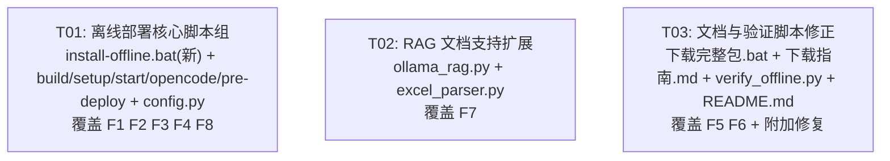

# COMAC-LocalAI-Windows 离线部署修复 — 实现方案与任务分解

> **版本**: 1.0  
> **日期**: 2025-07-07  
> **基于**: 代码审查 8 项修复规格 + 附加修复

---

## 1. 实现方案概述

### F1: 新增 install-offline.bat（离线一键安装）

**方案**: 新建 `install-offline.bat`，作为 clean Windows 10 上完整的离线安装入口。脚本将沿用 `setup.bat` 中已验证的 Ollama 提取/模型创建/.env 生成逻辑，但新增三个关键步骤：

1. **安装 Python**: 使用 `tools/python-3.11.8-amd64.exe` 静默安装到 `%LOCALAPPDATA%\Programs\Python\Python311`
2. **创建 .venv**: 用刚安装的 Python 执行 `python -m venv .venv`
3. **离线安装依赖**: `pip install --no-index --find-links=python-wheels -r requirements.lock.txt`

脚本末尾输出清晰的下一步指引（启动 `start.bat`、访问地址等）。

### F2: build-offline-package.bat 补充复制部署脚本

**方案**: 在 `build-offline-package.bat` 现有"步骤 9: 复制应用代码"之后，新增一个步骤将 `install-offline.bat`、`start.bat`、`opencode.bat`、`README.md` 复制到 `offline_bundle\` 根目录。同时将步骤 12 完成提示中的"将在后续版本提供"替换为实际使用说明。

### F3: install-offline.bat 负责创建 .venv + setup.bat CHECK_PY_VER bug 修复

**方案**:
- `install-offline.bat`（F1）自身包含 Python 安装和 .venv 创建，不依赖预存在的 .venv。
- `setup.bat` 第 48-50 行：Python fallback 安装成功后，补充设置 `CHECK_PY_VER=11`（或通过调用已安装 Python 查询实际版本），避免后续第 74 行 `VENV_PY_VER` 与空的 `CHECK_PY_VER` 比较出错。

### F4: 修复 requirements.lock.txt 生成

**方案**: 重写 `build-offline-package.bat` 步骤 7-8：

1. **新建临时 .build_venv**: `python -m venv .build_venv`
2. **安装全部依赖**: `.build_venv\Scripts\pip install -r requirements.txt`
3. **生成完整依赖树**: `.build_venv\Scripts\pip freeze > requirements.lock.txt`
4. **基于 freeze 结果下载 wheels**: `.build_venv\Scripts\pip download -r requirements.lock.txt --dest python-wheels --platform win_amd64 --python-version 3.11 --only-binary=:all:`
5. **清理 .build_venv**

这样可以获得包含所有传递依赖的完整锁定文件，且 wheels 与 lock 文件完全一致。

### F5: 统一 Python 安装包路线

**方案**: 全仓统一使用 `python-3.11.8-amd64.exe`（安装版），删除 Embeddable zip 路线：
- `下载完整包.bat`: 步骤 [3/4] 从下载 `python-3.11.8-embed-amd64.zip` 改为 `python-3.11.8-amd64.exe`，并更新提示文字
- `下载指南.md`: 第三步标题从"下载 Python Embeddable"改为"下载 Python 安装包"，文件名和描述全面更新；第六步从"解压 Python Embeddable"改为"安装 Python"

### F6: 统一模型文件名

**方案**: 所有文档/脚本中 GGUF 文件名统一为 `qwen2.5-7b-instruct-q4_k_m.gguf`（与 `ollama-models/Modelfile` 第 16 行 `FROM ./qwen2.5-7b-instruct-q4_k_m.gguf` 一致）：
- `下载完整包.bat` 第 89 行: `qwen2.5-7b-q4_k_m.gguf` → `qwen2.5-7b-instruct-q4_k_m.gguf`
- `下载指南.md` 第 53-55 行: 两处文件名修正

### F7: RAG 文档支持与实际索引对齐

**方案**: 扩展 `ollama_rag.py` 的 `index_documents()` 和 `index_file()` 以支持全部声明格式。具体：

1. **`ollama_rag.py` index_documents()**: patterns 从 `['*.md', '*.txt', '*.pdf']` 扩展为 `['*.md', '*.txt', '*.pdf', '*.docx', '*.pptx', '*.xlsx', '*.csv']`
2. **`ollama_rag.py` index_file()**: 对 docx/pptx/xlsx/csv 使用已有的 `ParserFactory.extract_text()` 统一提取文本（替代现有仅支持 md/txt/pdf 的分支）
3. **`parsers/excel_parser.py` parse()**: 按文件后缀分流：`.csv` → `pd.read_csv()`，`.xlsx/.xls` → 保持现有 `pd.ExcelFile()` 逻辑
4. **`parsers/parser_factory.py`**: `.csv` 保持映射到 `ExcelParser()`（ExcelParser 内部已支持 CSV 分流）

### F8: opencode.bat 加 OLLAMA_MODELS + 统一端口 11435

**方案**:

**A. OLLAMA_MODELS**: 在 `opencode.bat` 第 30 行 `set "OLLAMA_HOST=..."` 之后，新增 `set "OLLAMA_MODELS=%SCRIPT_DIR%ollama-cache"`，确保 TUI 对话也使用项目内模型缓存目录。

**B. 端口统一为 11435**: 全仓将所有 Ollama 端口从 11434 改为 11435，避免复用系统 Ollama 服务。涉及文件及位置：

| 文件 | 行号 | 内容 |
|------|------|------|
| `setup.bat` | 176 | 硬编码 `localhost:11434` → `localhost:11435` |
| `setup.bat` | 264 | `.env` 生成 `OLLAMA_HOST=localhost:11434` → `11435` |
| `start.bat` | 54 | `set "OLLAMA_HOST=localhost:11434"` → `11435` |
| `opencode.bat` | 30 | `set "OLLAMA_HOST=localhost:11434"` → `11435` |
| `pre-deploy.bat` | 139 | 硬编码 `localhost:11434` → `localhost:11435` |
| `pre-deploy.bat` | 236 | `.env` 生成 `OLLAMA_HOST=localhost:11434` → `11435` |
| `config.py` | 23 | `"localhost:11434"` → `"localhost:11435"` |
| `README.md` | 134 | 环境变量表 `localhost:11434` → `localhost:11435` |

### 附加修复: verify_offline.py

**A. ollama.list() 响应处理修复**: `check_ollama()` 函数（第 15-25 行）当前使用字典方式 `response.get('models', [])` 访问 `ollama.list()` 返回的 `ListResponse` 对象。参照 `ollama_client.py` 第 187-190 行的正确方式，改为使用 `.models` 属性：
```python
model_list = getattr(response, 'models', []) or []
model_names = [getattr(m, 'model', str(m)) for m in model_list]
```

**B. 移除 Linux 风格错误消息**:
- 第 33 行: `"setup.sh"` → `"setup.bat"`
- 第 148 行: `Path.home() / "ollama-doc-models"` → 项目相对路径（如 `SCRIPT_DIR/ollama-doc-models`），或改为 Windows 风格提示
- 第 153 行: `"pdfocr.sh"` → `"pdfocr.bat"`（或移除 .sh 引用）
- 第 234 行: `"cd ~/ollama-doc-models && bash setup.sh"` → Windows 风格命令

### 附加修复: README.md 许可证

**评估**: "内部使用，请勿外传" 仅作为组织内部使用声明，技术上不构成安全漏洞。建议保留但加注为"仅供 COMAC 内部授权使用"以更专业。

---

## 2. 文件变更清单

| # | 文件路径 | 变更类型 | 变更内容摘要 |
|---|----------|----------|-------------|
| 1 | `install-offline.bat` | **新增** | 离线一键安装脚本：安装 Python → 创建 .venv → 离线安装依赖 → 提取 Ollama → 创建模型 → 生成 .env |
| 2 | `setup.bat` | 修改 | (a) Python fallback 安装后补充 `CHECK_PY_VER` 设置；(b) 端口 11434→11435（第 176、264 行） |
| 3 | `build-offline-package.bat` | 修改 | (a) 新增步骤：复制 install-offline.bat/start.bat/opencode.bat/README.md 到 offline_bundle；(b) 重写步骤 7-8：临时 .build_venv → freeze → download；(c) 更新完成提示文字 |
| 4 | `start.bat` | 修改 | 端口 11434→11435（第 54 行） |
| 5 | `opencode.bat` | 修改 | (a) 新增 `OLLAMA_MODELS` 环境变量；(b) 端口 11434→11435（第 30 行） |
| 6 | `pre-deploy.bat` | 修改 | 端口 11434→11435（第 139、236 行） |
| 7 | `config.py` | 修改 | 默认端口 11434→11435（第 23 行） |
| 8 | `ollama_rag.py` | 修改 | (a) `index_documents()` patterns 扩展支持 docx/pptx/xlsx/csv；(b) `index_file()` 使用 ParserFactory 统一提取文本；(c) `sync_index()` patterns 同步扩展 |
| 9 | `parsers/excel_parser.py` | 修改 | `parse()` 方法按后缀分流：.csv → `pd.read_csv()`，.xlsx/.xls → 现有 `pd.ExcelFile()` |
| 10 | `parsers/parser_factory.py` | 无需修改 | `.csv` 继续映射到 `ExcelParser()`（ExcelParser 内部已支持 CSV） |
| 11 | `下载完整包.bat` | 修改 | (a) Python 下载从 embed zip 改为 amd64.exe；(b) GGUF 文件名修正为含 `instruct` |
| 12 | `下载指南.md` | 修改 | (a) 第三步 Python Embeddable → 安装版；(b) 第六步"解压" → "安装"；(c) GGUF 文件名修正 |
| 13 | `verify_offline.py` | 修改 | (a) `check_ollama()` 使用 `.models` 属性；(b) 移除所有 Linux 风格路径/命令（setup.sh → setup.bat, ~/ollama-doc-models → Windows 路径） |
| 14 | `README.md` | 修改 | (a) 许可证措辞优化；(b) OLLAMA_HOST 默认端口更新 |

---

## 3. 任务列表

### T01: 离线部署核心脚本组（install-offline.bat 新建 + 构建/启动脚本修复）

| 项目 | 内容 |
|------|------|
| **任务 ID** | T01 |
| **任务名称** | 离线部署核心脚本：新建 install-offline.bat + 修复 build/setup/start/opencode + 端口统一 |
| **源文件** | `install-offline.bat`(新), `build-offline-package.bat`, `setup.bat`, `start.bat`, `opencode.bat`, `pre-deploy.bat`, `config.py` |
| **依赖** | 无 |
| **优先级** | P0 |
| **覆盖修复** | F1, F2, F3, F4, F8 |

**详细变更**:

1. **新建 `install-offline.bat`** (F1, F3)
   - 步骤 1: 检查 Python；若无，使用 `tools\python-3.11.8-amd64.exe` 静默安装
   - 步骤 2: 用安装的 Python 创建 `.venv`
   - 步骤 3: `pip install --no-index --find-links=python-wheels -r requirements.lock.txt`
   - 步骤 4-8: 复用 setup.bat 的 Ollama 提取/VC++/启动/模型创建/.env 生成逻辑
   - 端口使用 11435

2. **修改 `build-offline-package.bat`** (F2, F4)
   - 在应用代码复制后新增步骤：复制 install-offline.bat, start.bat, opencode.bat, README.md 到 offline_bundle 根目录
   - 重写步骤 7-8（wheel 下载 + lock 生成）：
     - 创建临时 `.build_venv`
     - `pip install -r requirements.txt`
     - `pip freeze > requirements.lock.txt`（含完整依赖树）
     - `pip download -r requirements.lock.txt --dest python-wheels --platform win_amd64 --python-version 3.11 --only-binary=:all:`
     - 清理 `.build_venv`
   - 更新步骤 12 完成提示：移除"将在后续版本提供"

3. **修改 `setup.bat`** (F3 bug + F8 端口)
   - 第 48-50 行后：Python fallback 安装成功后补充 `set "CHECK_PY_VER=11"`
   - 第 176 行：`localhost:11434` → `localhost:11435`
   - 第 264 行：`.env` 中 `OLLAMA_HOST=localhost:11434` → `11435`

4. **修改 `start.bat`** (F8 端口)
   - 第 54 行：`set "OLLAMA_HOST=localhost:11434"` → `11435`

5. **修改 `opencode.bat`** (F8)
   - 第 30 行后新增：`set "OLLAMA_MODELS=%SCRIPT_DIR%ollama-cache"`
   - 第 30 行：`set "OLLAMA_HOST=localhost:11434"` → `11435`

6. **修改 `pre-deploy.bat`** (F8 端口)
   - 第 139 行：`localhost:11434` → `localhost:11435`
   - 第 236 行：`.env` 中 `OLLAMA_HOST=localhost:11434` → `11435`

7. **修改 `config.py`** (F8 端口)
   - 第 23 行：`"localhost:11434"` → `"localhost:11435"`

---

### T02: RAG 文档支持扩展

| 项目 | 内容 |
|------|------|
| **任务 ID** | T02 |
| **任务名称** | RAG 文档支持扩展：支持 docx/pptx/xlsx/csv + ExcelParser CSV 分流 |
| **源文件** | `ollama_rag.py`, `parsers/excel_parser.py` |
| **依赖** | 无（可独立于 T01 实现） |
| **优先级** | P1 |
| **覆盖修复** | F7 |

**详细变更**:

1. **修改 `parsers/excel_parser.py`**
   - `parse()` 方法开头检查 `Path(file_path).suffix.lower()`:
     - `.csv` → `df = pd.read_csv(file_path)` → 单 sheet 输出
     - `.xlsx` / `.xls` → 保持现有 `pd.ExcelFile()` 多 sheet 逻辑
   - `extract_text()` 无需变更（调用 `parse()` 自动分流）

2. **修改 `ollama_rag.py`**
   - `index_documents()` 第 330 行：`patterns` 从 `['*.md', '*.txt', '*.pdf']` 扩展为 `['*.md', '*.txt', '*.pdf', '*.docx', '*.pptx', '*.xlsx', '*.csv']`
   - `index_file()` 第 242-271 行：在现有 md/txt/pdf 分支之后，新增通用分支：
     ```python
     else:
         try:
             from parsers.parser_factory import ParserFactory
             content = ParserFactory.extract_text(file_path)
         except Exception as e:
             print(f"[RAG] Failed to read {file_path}: {e}")
             return 0
     ```
   - `sync_index()` 第 426 行：`patterns` 同步扩展（同 `index_documents()`）

> **注意**: `parser_factory.py` 无需修改 — `.csv` 继续映射到 `ExcelParser()`，ExcelParser 内部已支持 CSV 分流。

---

### T03: 文档与验证脚本修正

| 项目 | 内容 |
|------|------|
| **任务 ID** | T03 |
| **任务名称** | 文档一致性修正 + verify_offline.py 修复 + README 终审 |
| **源文件** | `下载完整包.bat`, `下载指南.md`, `verify_offline.py`, `README.md` |
| **依赖** | 无（可独立于 T01/T02 实现） |
| **优先级** | P1 |
| **覆盖修复** | F5, F6, 附加修复 (verify_offline.py + README.md) |

**详细变更**:

1. **修改 `下载完整包.bat`** (F5, F6)
   - 步骤 [3/4] 标题和说明：`python-3.11.8-embed-amd64.zip` → `python-3.11.8-amd64.exe`
   - 步骤 [4/4] 第 89 行：`qwen2.5-7b-q4_k_m.gguf` → `qwen2.5-7b-instruct-q4_k_m.gguf`

2. **修改 `下载指南.md`** (F5, F6)
   - 第三步标题："下载 Python Embeddable" → "下载 Python 安装包"
   - 第三步文件名：`python-3.11.8-embed-amd64.zip` → `python-3.11.8-amd64.exe`
   - 第三步目录结构示例：`python-3.11.8-embed-amd64.zip` → `python-3.11.8-amd64.exe`
   - 第四步第 53 行：`qwen2.5-7b-q4_k_m.gguf` → `qwen2.5-7b-instruct-q4_k_m.gguf`
   - 第六步说明："解压 Python Embeddable 到 `tools/python/`" → "双击安装 Python（安装到默认路径）"
   - 故障排查："Python 未找到" → 提示运行 install-offline.bat

3. **修改 `verify_offline.py`** (附加修复)
   - `check_ollama()` 第 15-25 行：将字典访问改为 `.models` 属性访问
     ```python
     response = ollama.list()
     model_list = getattr(response, 'models', []) or []
     model_names = [getattr(m, 'model', str(m)) for m in model_list]
     ```
   - 第 33 行：`"setup.sh"` → `"setup.bat"`
   - 第 148 行：`Path.home() / "ollama-doc-models"` → Windows 风格路径
   - 第 153 行：`"pdfocr.sh"` → `"pdfocr.bat"`
   - 第 234 行：`"cd ~/ollama-doc-models && bash setup.sh"` → 相应 Windows 命令

4. **修改 `README.md`** (附加修复)
   - 许可证部分："内部使用，请勿外传" → "仅供 COMAC 内部授权使用"
   - 环境变量表：`OLLAMA_HOST` 默认值 `localhost:11434` → `localhost:11435`

---

## 4. 数据结构 / 接口变更

### 4.1 ExcelParser.parse() 签名不变，内部逻辑扩展

```
# 变更前
def parse(self, file_path: str) -> Document:
    excel_file = pd.ExcelFile(file_path)  # CSV 会在此处失败

# 变更后
def parse(self, file_path: str) -> Document:
    suffix = Path(file_path).suffix.lower()
    if suffix == '.csv':
        df = pd.read_csv(file_path)
        content = df.to_string()
        return Document(content=content, metadata={...}, format="csv", pages=[content])
    else:
        excel_file = pd.ExcelFile(file_path)
        # ... 现有逻辑不变
```

### 4.2 ollama_rag.py index_file() 新增通用解析分支

```
# 在现有 if/elif 链末尾新增 else 分支:
else:
    try:
        from parsers.parser_factory import ParserFactory
        content = ParserFactory.extract_text(file_path)
    except Exception as e:
        print(f"[RAG] Failed to read {file_path}: {e}")
        return 0
```

### 4.3 端口常量变更

```
# config.py
OLLAMA_HOST = os.environ.get("OLLAMA_HOST", "localhost:11435")  # was 11434
```

所有 `.bat` 脚本中硬编码的 `localhost:11434` 均改为 `localhost:11435`。

---

## 5. 依赖包列表

本次修复**无需新增外部依赖**。所有使用的库（`pandas`, `python-docx`, `python-pptx`, `openpyxl`, `pdfplumber`, `PyMuPDF`）已在 `requirements.txt` 中声明。

CSV 读取通过已有的 `pandas` 库实现；docx/pptx/xlsx 解析通过已有的 `parsers` 模块实现。

---

## 6. 待明确事项

| # | 问题 | 影响范围 | 建议 |
|---|------|----------|------|
| Q1 | `start.sh` 是否也需要同步修改端口和 OLLAMA_MODELS？ | `start.sh` 第 30 行有 `OLLAMA_HOST` 硬编码 11434 | 如果 start.sh 仍在维护，需同步修改；否则可标记为废弃 |
| Q2 | 端口 11435 变更后，是否有其他未列出的脚本/配置文件引用 11434？ | `cli_chat.py` 第 68 行有 `"localhost:11434"` fallback | `cli_chat.py` 优先从 `config.py` 读取，fallback 仅在 `import config` 失败时使用，也应修改 |
| Q3 | `install-offline.bat` 安装 Python 时是否需要 `PrependPath=0`？ | 内网机器 PATH 环境 | 当前 `setup.bat` 使用 `PrependPath=0`（不修改系统 PATH），`install-offline.bat` 建议保持一致 |
| Q4 | `verify_offline.py` 的 `check_ocr_tools()` 在 Windows 上是否实际可用？ | OCR 功能验证 | 该函数检查 `~/ollama-doc-models/ocrtext` 和 `pdfocr.sh`，均为 Linux 路径；建议评估 OCR 功能在 Windows 上的整体支持状态 |
| Q5 | `requirements.lock.txt` 是否应加入 `.gitignore`？ | 版本控制 | `requirements.lock.txt` 由 `build-offline-package.bat` 动态生成，建议加入 `.gitignore` |

---

## 7. 任务依赖图



> **说明**: T01、T02、T03 相互独立，无文件交叉，可并行实施。建议 T01 先行（涉及端口统一，T03 中 README.md 的端口更新以 T01 的最终值为准）。

---

## 8. Shared Knowledge

```
- 所有 .bat 脚本使用 chcp 65001 + enabledelayedexpansion
- 内网机器为干净 Windows 10 x64，完全断网
- Ollama 端口统一为 11435（避免复用系统 Ollama）
- GGUF 文件名: qwen2.5-7b-instruct-q4_k_m.gguf（含 instruct）
- Ollama 模型名: qwen:7b-q4_K_M
- Python 安装包: python-3.11.8-amd64.exe（安装版，非 Embeddable）
- .env 由脚本自动生成，包含随机 16 位密码
- OLLAMA_MODELS 环境变量指向项目内 ollama-cache 目录
- requirements.lock.txt 由 build-offline-package.bat 在临时 .build_venv 中生成，含完整依赖树
```
