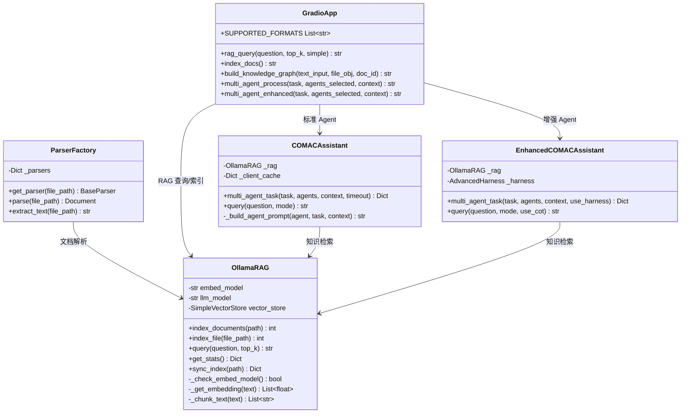
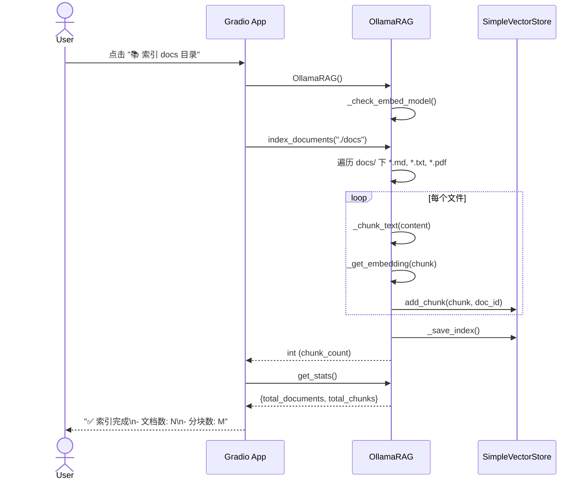
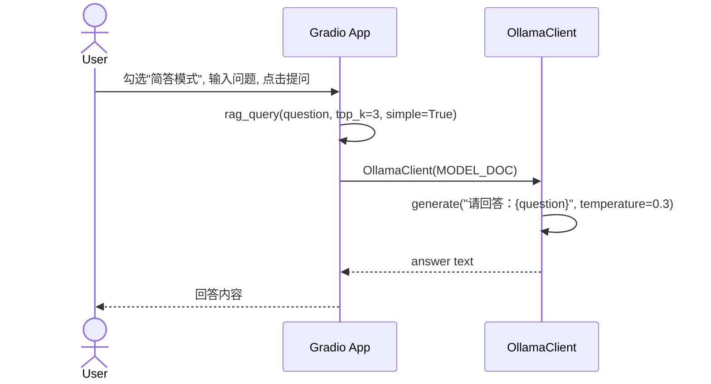
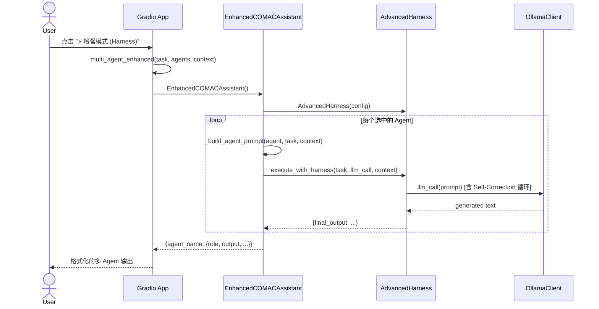
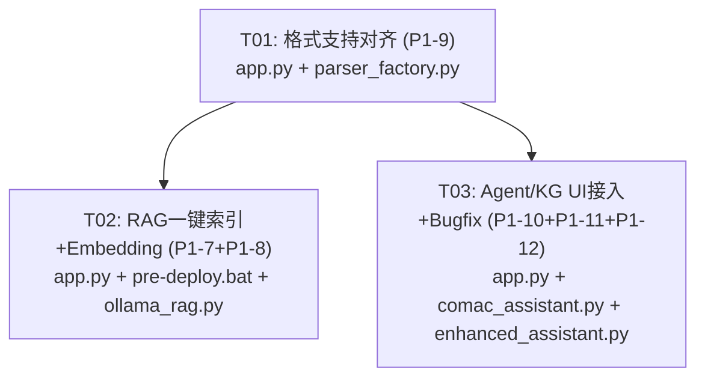

# P1 功能完整性修复 — 系统设计文档

## 概述

对 COMAC-LocalAI-Windows 平台 6 项 P1 功能完整性缺陷进行增量修复，涉及 5 个源文件，3 个任务组。

---

## Part A: 系统设计

### 1. Implementation Approach

#### 核心挑战

| # | 问题 | 根因 | 策略 |
|---|------|------|------|
| P1-7 | RAG 知识库无"一键索引"按钮，`rag_simple` 参数未传递 | UI 缺按钮 + 函数签名不完整 | 新增按钮+函数，补全签名 |
| P1-8 | Embedding 模型离线准备不闭环 | `pre-deploy.bat` 只处理主模型 | 追加 embedding 下载步骤 |
| P1-9 | 支持格式列表与实际解析能力不一致 | 格式列表含 `.doc/.ppt/.xls` 但只有新式格式解析器 | 与 `parser_factory.py` 同步收缩 |
| P1-10 | 知识图谱文件上传未接入处理函数 | `btn_kg.click` 未传 `kg_file` | 修改函数签名+绑定 |
| P1-11 | 增强模式按钮未绑定事件 | 按钮无 `.click()` | 新增增强处理函数+绑定 |
| P1-12 | 多Agent超时分支变量作用域 bug | `agent` 在 `run_agent` 闭包内，外部不可见 | 用 `AGENTS[role]` 替代 |

#### 技术选型与框架

- **无需新增依赖**：所有修复均在现有库（Gradio, Ollama, python-docx, pandas 等）范围内
- **架构模式**：MVC（Gradio UI 为 View，处理函数为 Controller，ollama_rag/comac_assistant 为 Model）
- **修改范围**：5 个文件，零新增文件，纯增量修改

---

### 2. File List

```
COMAC-LocalAI-Windows/
├── app.py                          # [修改] P1-7, P1-9, P1-10, P1-11
├── comac_assistant.py              # [修改] P1-12
├── enhanced_assistant.py           # [只读] P1-11 - API 参考
├── ollama_rag.py                   # [修改] P1-8
├── parsers/
│   └── parser_factory.py           # [修改] P1-9
└── pre-deploy.bat                  # [修改] P1-8
```

---

### 3. Data Structures and Interfaces



---

### 4. Program Call Flow

#### P1-7: RAG 一键索引



#### P1-7: RAG 简答模式



#### P1-11: 增强模式 Agent 执行



---

### 5. Anything UNCLEAR

1. **P1-11 EnhancedAssistant API 兼容性**：`EnhancedCOMACAssistant.multi_agent_task()` 的返回格式与 `COMACAssistant.multi_agent_task()` 不同——增强版不返回 `elapsed` 字段。UI 格式化代码已做适配（缺失字段时静默跳过）。

2. **P1-8 Embedding 模型下载**：`pre-deploy.bat` 中的 embedding 模型下载设计为"非阻断"——即使下载失败也不影响后续步骤，仅打印提示。这与现有 `_check_embed_model()` fallback 逻辑一致。

3. **P1-10 文件上传与文本输入优先级**：当同时提供文本和文件时，文件内容优先（覆盖文本输入），文档 ID 从文件名提取。

---

## Part B: 任务分解

### 6. Required Packages

无需新增第三方包。所有修复在现有依赖范围内：
- `gradio` — UI 交互
- `ollama` — 模型推理
- `python-docx`, `python-pptx`, `pandas`, `openpyxl` — 文档解析（已有）

---

### 7. Task List

#### T01: 格式支持对齐 (P1-9)

| 属性 | 值 |
|------|-----|
| **Task ID** | T01 |
| **Task Name** | 格式支持列表与解析器同步 (P1-9) |
| **Source Files** | `app.py`, `parsers/parser_factory.py` |
| **Dependencies** | 无 |
| **Priority** | P0（基础性修复，影响文件上传白名单和 UI 展示） |

**修改内容**：

1. **`app.py` 第 75 行** — `SUPPORTED_FORMATS` 收缩为真实现有格式：
   ```python
   # Before:
   SUPPORTED_FORMATS = [".docx", ".doc", ".pdf", ".pptx", ".ppt", ".xlsx", ".xls", ".txt"]
   # After:
   SUPPORTED_FORMATS = [".docx", ".pdf", ".pptx", ".xlsx", ".txt", ".md", ".csv"]
   ```

2. **`app.py` 第 863 行** — RAG Tab Markdown 说明更新：
   ```markdown
   # Before:
   **文档支持**: `.md`, `.txt`, `.pdf`
   # After:
   **文档支持**: `.docx`, `.pdf`, `.pptx`, `.xlsx`, `.txt`, `.md`, `.csv`
   ```

3. **`parsers/parser_factory.py` 第 10-19 行** — 解析器映射同步：
   ```python
   # Before:
   _parsers = {
       ".docx": WordParser(),
       ".doc": WordParser(),    # 移除
       ".pdf": PDFParser(),
       ".pptx": PPTParser(),
       ".ppt": PPTParser(),     # 移除
       ".xlsx": ExcelParser(),
       ".xls": ExcelParser(),   # 移除
       ".txt": TextParser(),
   }
   # After:
   _parsers = {
       ".docx": WordParser(),
       ".pdf": PDFParser(),
       ".pptx": PPTParser(),
       ".xlsx": ExcelParser(),
       ".csv": ExcelParser(),   # pandas 原生支持 CSV
       ".txt": TextParser(),
       ".md": TextParser(),     # Markdown 作为纯文本解析
   }
   ```

---

#### T02: RAG 一键索引 + Embedding 离线闭环 (P1-7 + P1-8)

| 属性 | 值 |
|------|-----|
| **Task ID** | T02 |
| **Task Name** | RAG 知识库一键索引 + Embedding 模型离线准备 |
| **Source Files** | `app.py`, `pre-deploy.bat`, `ollama_rag.py` |
| **Dependencies** | T01（依赖 `SUPPORTED_FORMATS` 和 parser 映射） |
| **Priority** | P1 |

**修改内容**：

1. **`app.py`** — 新增 `index_docs()` 函数和按钮绑定：

   a) 在 `rag_query` 函数之前新增 `index_docs()`：
   ```python
   def index_docs():
       """一键索引 docs/ 目录"""
       if not OLLAMA_AVAILABLE:
           return "⚠️ Ollama 服务未连接，无法索引"
       try:
           from ollama_rag import OllamaRAG
           rag = OllamaRAG()
           rag.index_documents("./docs")
           stats = rag.get_stats()
           return (
               f"✅ 索引完成\n\n"
               f"- 文档数: {stats.get('total_documents', 0)}\n"
               f"- 分块数: {stats.get('total_chunks', 0)}"
           )
       except Exception as e:
           return f"❌ 索引失败: {str(e)[:200]}"
   ```

   b) 修改 `rag_query` 函数签名，支持 `simple` 参数：
   ```python
   # Before:
   def rag_query(question, top_k=3):
   # After:
   def rag_query(question, top_k=3, simple=False):
       if not question or not question.strip():
           return "💬 请输入问题"
       if not OLLAMA_AVAILABLE:
           return "⚠️ Ollama 服务未连接，RAG 不可用"
       # 简答模式：跳过 RAG，直接 LLM
       if simple:
           try:
               from ollama_client import OllamaClient, MODEL_DOC
               client = OllamaClient(MODEL_DOC)
               safe_q = _sanitize_user_input(question)
               return client.generate(f"请回答：{safe_q}", temperature=0.3)
           except Exception as e:
               return f"❌ 简答失败: {str(e)[:200]}"
       # ... 原有 RAG 逻辑 ...
   ```

   c) 在 RAG Tab UI 中添加索引按钮（第 853 行附近）：
   ```python
   # 在 btn_rag 之后添加：
   btn_index_docs = gr.Button("📚 索引 docs 目录", variant="secondary")
   ```

   d) 修改按钮绑定：
   ```python
   # Before:
   btn_rag.click(fn=rag_query, inputs=[rag_question, rag_topk], outputs=out_rag)
   # After:
   btn_rag.click(fn=rag_query, inputs=[rag_question, rag_topk, rag_simple], outputs=out_rag)
   btn_index_docs.click(fn=index_docs, outputs=out_rag)
   ```

   e) 删除 RAG Tab Markdown 中的 python 代码块（第 865-870 行），替换为简单说明：
   ```markdown
   **使用方式**: 点击下方"索引 docs 目录"按钮，系统自动索引 `docs/` 下的文档
   ```

2. **`pre-deploy.bat`** — 在第 192 行（qwen pull 成功后）追加 embedding 模型处理：
   ```bat
   REM ============================================================================
   REM  步骤 5.5: 下载 embedding 模型（可选、非阻断）
   REM ============================================================================
   echo.
   echo         尝试下载 embedding 模型（可选）...
   "%OLLAMA_BIN%" pull nomic-embed-text 2>nul
   if errorlevel 1 (
       echo   [提示] embedding 模型下载失败，RAG 将使用主模型生成向量
   ) else (
       echo   [OK] embedding 模型下载完成
   )
   ```

3. **`ollama_rag.py`** — `_check_embed_model()` 增强日志提示（第 197-209 行）：
   ```python
   def _check_embed_model(self) -> bool:
       try:
           models = self._embed_client.list_models()
           if self.embed_model in models:
               return True
           # embedding 模型不可用
           print(f"[RAG] Embedding model '{self.embed_model}' not available, "
                 f"will use main model '{self.llm_model}' for embeddings. "
                 f"Tip: run 'ollama pull nomic-embed-text' or use pre-deploy.bat to install.")
           self._embed_client = OllamaClient(self.llm_model)
           return False
       except Exception as e:
           print(f"[RAG] Cannot verify embed model: {e}, will fallback to main model.")
           return False
   ```

---

#### T03: Agent/KG UI 接入 + 变量作用域 Bug 修复 (P1-10 + P1-11 + P1-12)

| 属性 | 值 |
|------|-----|
| **Task ID** | T03 |
| **Task Name** | 知识图谱文件上传接入、增强模式按钮绑定、多Agent超时bug修复 |
| **Source Files** | `app.py`, `comac_assistant.py`, `enhanced_assistant.py`(只读) |
| **Dependencies** | T01（依赖 `SUPPORTED_FORMATS`） |
| **Priority** | P1 |

**修改内容**：

1. **`app.py`** — 知识图谱文件上传接入 (P1-10)：

   a) 修改 `build_knowledge_graph` 函数签名（第 544 行）：
   ```python
   # Before:
   def build_knowledge_graph(text_or_file, doc_id=""):
   # After:
   def build_knowledge_graph(text_input="", file_obj=None, doc_id=""):
       # 处理文件上传
       content = text_input
       if file_obj is not None:
           try:
               file_path = save_file(file_obj)
               doc = parser.parse(file_path)
               content = doc.content
               doc_id = file_obj.name if hasattr(file_obj, 'name') else "uploaded"
           except Exception as e:
               return f"❌ 文件解析失败: {str(e)[:200]}"
       elif not text_input or not text_input.strip():
           return "🧠 请输入文本内容或上传文档"
       # ... 后续逻辑不变 ...
   ```

   b) 修改按钮绑定（第 950 行）：
   ```python
   # Before:
   btn_kg.click(fn=build_knowledge_graph, inputs=[kg_input], outputs=out_kg)
   # After:
   btn_kg.click(fn=build_knowledge_graph, inputs=[kg_input, kg_file], outputs=out_kg)
   ```

2. **`app.py`** — 增强模式按钮绑定 (P1-11)：

   a) 新增 `multi_agent_enhanced` 函数（插入到 `multi_agent_process` 之后）：
   ```python
   def multi_agent_enhanced(task, agents_selected, context=""):
       """增强模式多Agent协作（启用 Harness: Self-Correction + CoT + Quality Gates）"""
       if not task or not task.strip():
           return "🤖 请输入任务描述"
       if not OLLAMA_AVAILABLE:
           return "⚠️ Ollama 服务未连接，增强模式不可用"
       try:
           from enhanced_assistant import EnhancedCOMACAssistant, AgentRole as EnhancedAgentRole

           agent_map = {
               "主编 (张明)": EnhancedAgentRole.CHIEF_EDITOR,
               "校审 (李华)": EnhancedAgentRole.PROOFREADER,
               "文档 (陈静)": EnhancedAgentRole.DOCUMENT_AGENT,
               "知识 (刘伟)": EnhancedAgentRole.KNOWLEDGE_AGENT,
               "可视化 (王芳)": EnhancedAgentRole.VISUALIZATION,
           }

           selected_roles = [agent_map[a] for a in agents_selected if a in agent_map]
           if not selected_roles:
               selected_roles = [EnhancedAgentRole.CHIEF_EDITOR]

           safe_task = _sanitize_user_input(task)
           safe_context = _sanitize_user_input(context)

           assistant = EnhancedCOMACAssistant()
           results = assistant.multi_agent_task(
               task=safe_task,
               agents=selected_roles,
               context=safe_context,
               use_harness=True
           )

           output = []
           for name, data in results.items():
               role = data.get("role", "unknown")
               output.append(f"### {name} ({role}) [增强模式]")
               if "error" in data:
                   output.append(f"❌ {data['error']}")
               else:
                   output.append(data.get("output", "无输出")[:500])
               output.append("")

           return "\n".join(output) if output else "无结果"
       except ImportError:
           return "⚠️ 增强模式模块未安装，请使用标准模式"
       except Exception as e:
           return f"❌ 增强模式执行失败: {str(e)[:200]}"
   ```

   b) 绑定增强按钮（第 915 行附近）：
   ```python
   # 在 btn_agent.click(...) 之后添加：
   btn_agent_enhanced.click(
       fn=multi_agent_enhanced,
       inputs=[agent_task, agent_select, agent_context],
       outputs=out_agent
   )
   ```

3. **`comac_assistant.py`** — 多Agent超时变量作用域修复 (P1-12)：

   第 198 行修复：
   ```python
   # Before (BUG: agent 不在作用域内):
   if t.is_alive() and agent.name not in results:
       results[AGENTS[role].name] = {
           "role": role.value,
           "error": f"Timeout after {timeout}s"
       }
   # After (使用字典访问替代局部变量):
   if t.is_alive() and AGENTS[role].name not in results:
       results[AGENTS[role].name] = {
           "role": role.value,
           "error": f"Timeout after {timeout}s"
       }
   ```

   注意：原代码第一行的 `agent.name` 已被替换为 `AGENTS[role].name`（因为 `agent` 变量是 `run_agent` 闭包内的局部变量，外部不可见）。第二行的 `results[AGENTS[role].name]` 同样需要保持 `AGENTS[role]` 访问。

---

### 8. Shared Knowledge

```
- 所有 Gradio 回调函数返回值均为纯文本字符串（Markdown 格式）
- Ollama 连接状态通过全局变量 OLLAMA_AVAILABLE 和 OLLAMA_VALID 控制
- 用户输入经过 _sanitize_user_input() 进行 Prompt 注入过滤后才传入 LLM
- 文件上传通过 save_file() 统一处理（路径清理 + 白名单扩展名验证）
- MODEL_DOC = qwen3:4b-q4_K_M，MODEL_EMBED = nomic-embed-text（来自 config.py）
- enhanced_assistant.py 定义了自己的 AgentRole 枚举（与 comac_assistant.py 中的同名但独立）
- EnhancedCOMACAssistant.multi_agent_task() 不返回 elapsed 时间字段
- pre-deploy.bat 中 embedding 模型下载为"非阻断"——失败只打印提示不中断
- ParserFactory 使用类方法（@classmethod），单例模式
```

---

### 9. Task Dependency Graph



T02 和 T03 互不依赖，可并行实施。两者均依赖 T01 完成后的 `SUPPORTED_FORMATS` 和 parser 映射一致性。

---

## 附录：验收检查清单

| # | 检查项 | 预期结果 |
|---|--------|---------|
| P1-7A | 点击"📚 索引 docs 目录"按钮 | 显示索引完成，含文档数和分块数 |
| P1-7B | 勾选"简答模式"后提问 | 不经 RAG 直接返回 LLM 回答 |
| P1-8 | 执行 `pre-deploy.bat` | embedding 模型下载（成功或提示降级） |
| P1-9 | 上传 `.doc` 文件 | 被白名单拒绝（提示不支持） |
| P1-9 | 上传 `.md`/`.csv` 文件 | 正常解析处理 |
| P1-10 | KG Tab 上传文档 + 点击构建 | 从文件提取文本构建知识图谱 |
| P1-11 | Agent Tab 点击"增强模式"按钮 | 多 Agent 协作输出（标注 [增强模式]） |
| P1-12 | Agent 任一角色超时 | 不报 NameError，正确输出 "Timeout after 120s" |
